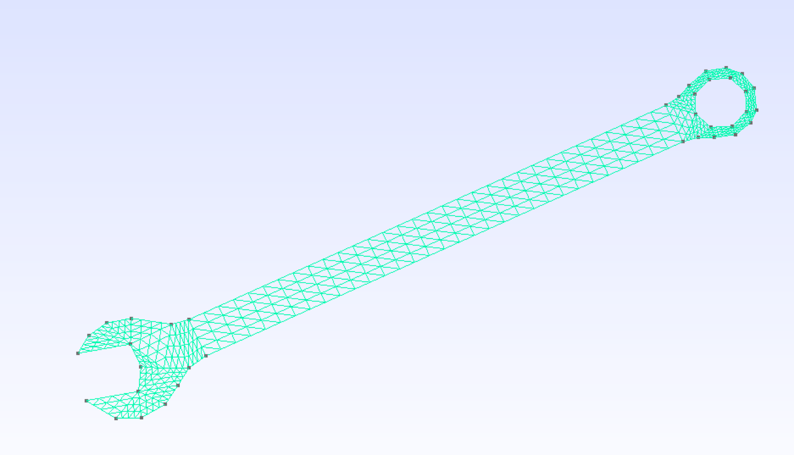

# Meshes to conduct 2D-Finite Element Analysis with Python

This _repo_ contains several finite element meshes, most of them created with [Gmsh](http://gmsh.info/), and to be analyzed with the python code
[SOLIDSPy](https://github.com/AppliedMechanics-EAFIT/SolidsPy)
## Authors
- [Juan Gomez](http://www.eafit.edu.co/docentes-investigadores/Paginas/juan-gomez.aspx),
    Professor at Universidad EAFIT.
- [Nicolás Guarín-Zapata](https://github.com/nicoguaro),
    Researcher at the Applied Mechanics Group at Universidad EAFIT.
